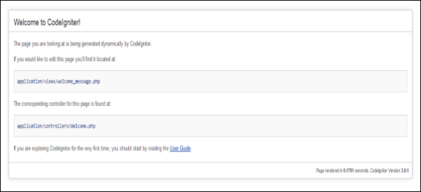
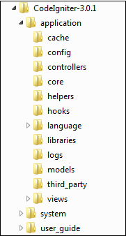

- **[Latest CodeIgniter](https://codeigniter.com/user_guide/index.html)**
- **[CodeIgniter V3](https://www.codeigniter.com/userguide3/general/welcome.html)**

### CodeIgniter - Overview

CodeIgniter is an application development framework, which can be used to develop websites, using PHP. It is an Open Source framework. It has a very rich set of functionality, which will increase the speed of website development work.

If you know PHP well, then CodeIgniter will make your task easier. It has a very rich set of libraries and helpers. By using CodeIgniter, you will save a lot of time, if you are developing a website from scratch. Not only that, a website built in CodeIgniter is secure too, as it has the ability to prevent various attacks that take place through websites.

### CodeIgniter Features

Some of the important features of CodeIgniter are listed below −
- Model-View-Controller Based System
- Model-View-Controller Based System
- Full Featured database classes with support for several platforms.
- Query Builder Database Support
- Form and Data Validation
- Security and XSS Filtering
- Session Management
- Email Sending Class. Supports Attachments, HTML/Text email, multiple protocols (sendmail, SMTP, and Mail) and more.
- Image Manipulation Library (cropping, resizing, rotating, etc.). Supports GD, ImageMagick, and NetPBM
- File Uploading Class
- FTP Class
- Localization
- Pagination
- Data Encryption
- Benchmarking
- Full Page Caching
- Error Logging
- Application Profiling
- Calendaring Class
- User Agent Class
- Zip Encoding Class
- Template Engine Class
- Trackback Class
- XML-RPC Library
- Unit Testing Class
- Search-engine Friendly URLs
- Flexible URI Routing
- Support for Hooks and Class Extensions
- Large library of “helper” functions

### CodeIgniter - Installing

It is very easy to install CodeIgniter. Just follow the steps given below −

- Step-1 − Download the CodeIgniter from the link CodeIgniter
- Step-2 − Unzip the folder.
- Step-3 − Upload all files and folders to your server.
- Step-4 − After uploading all the files to your server, visit the URL of your server, e.g., www.domain-name.com.

On visiting the URL, you will see the following screen −

### CodeIgniter - Application Architecture

The architecture of CodeIgniter application is shown below.

- As shown in the figure, whenever a request comes to CodeIgniter, it will first go to <b>index.php</b> page.
- In the second step, <b>Routing</b> will decide whether to pass this request to step-3 for caching or to pass this request to step-4 for security check.
- If the requested page is already in <b>Caching</b>, then <b>Routing</b> will pass the request to step-3 and the response will go back to the user.
- If the requested page does not exist in <b>Caching</b>, then <b>Routing</b> will pass the requested page to step-4 for <b>Security</b> checks.
- Before passing the request to <b>Application Controller</b>, the <b>Security</b> of the submitted data is checked. After the <b>Security</b> check, the <b>Application Controller</b> loads necessary <b>Models</b>, <b>Libraries</b>, <b>Helpers</b>, <b>Plugins</b> and <b>Scripts</b> and pass it on to <b>View</b>.
- The <b>View</b> will render the page with available data and pass it on for <b>Caching</b>. As the requested page was not cached before so this time it will be cached in <b>Caching</b>, to process this page quickly for future requests.

### Directory Structure

The image given below shows the directory structure of the CodeIgniter.

CodeIgniter directory structure is divided into 3 folders −

- Application
- System
- User_guide

#### Application

As the name indicates the Application folder contains all the code of your application that you are building. This is the folder where you will develop your project. The Application folder contains several other folders, which are explained below −

- <b>Cache</b> − This folder contains all the cached pages of your application. These cached pages will increase the overall speed of accessing the pages.
- <b>Config</b> − This folder contains various files to configure the application. With the help of config.php file, user can configure the application. Using database.php file, user can configure the database of the application.
- <b>Controllers</b> − This folder holds the controllers of your application. It is the basic part of your application.
- <b>Core</b> − This folder will contain base class of your application.
- <b>Helpers</b> − In this folder, you can put helper class of your application.
- <b>Hooks</b> − The files in this folder provide a means to tap into and modify the inner workings of the framework without hacking the core files.
- <b>Language</b> − This folder contains language related files.
- <b>Libraries</b> − This folder contains files of the libraries developed for your application.
- <b>Logs</b> − This folder contains files related to the log of the system.
- <b>Models</b> − The database login will be placed in this folder.
- <b>Third_party</b> − In this folder, you can place any plugins, which will be used for your application.
- <b>Views</b> − Application’s HTML files will be placed in this folder.

#### System

This folder contains CodeIgniter core codes, libraries, helpers and other files, which help make the coding easy. These libraries and helpers are loaded and used in web app development.

This folder contains all the CodeIgniter code of consequence, organized into various folders −

- <b>Core</b> − This folder contains CodeIgniter’s core class. Do not modify anything here. All of your work will take place in the application folder. Even if your intent is to extend the CodeIgniter core, you have to do it with hooks, and hooks live in the application folder.
- <b>Database</b> − The database folder contains core database drivers and other database utilities.
- <b>Fonts</b> − The fonts folder contains font related information and utilities.
- <b>Helpers</b> − The helpers folder contains standard CodeIgniter helpers (such as date, cookie, and URL helpers).
- <b>Language</b> − The language folder contains language files. You can ignore it for now.
- <b>Libraries</b> − The libraries folder contains standard CodeIgniter libraries (to help you with e-mail, calendars, file uploads, and more). You can create your own libraries or extend (and even replace) standard ones, but those will be saved in the application/libraries directory to keep them separate from the standard CodeIgniter libraries saved in this particular folder.

#### User_guide

This is your user guide to CodeIgniter. It is basically, the offline version of user guide on CodeIgniter website. Using this, one can learn the functions of various libraries, helpers and classes. It is recommended to go through this user guide before building your first web app in CodeIgniter.

Beside these three folders, there is one more important file named “index.php”. In this file, we can set the application environment and error level and we can define system and application folder name. It is recommended, not to edit these settings if you do not have enough knowledge about what you are going to do.

### CodeIgniter - MVC Framework

CodeIgniter is based on the <b>Model-View-Controller (MVC) development pattern</b>. MVC is a software approach that separates application logic from presentation. In practice, it permits your web pages to contain minimal scripting since the presentation is separate from the PHP scripting.

- The <b>Model</b> represents your data structures. Typically, your model classes will contain functions that help you retrieve, insert and update information in your database.
- The <b>View</b> is information that is being presented to a user. A View will normally be a web page, but in CodeIgniter, a view can also be a page fragment like a header or footer. It can also be an RSS page, or any other type of “page”.
- The <b>Controller</b> serves as an intermediary between the Model, the View, and any other resources needed to process the HTTP request and generate a web page.